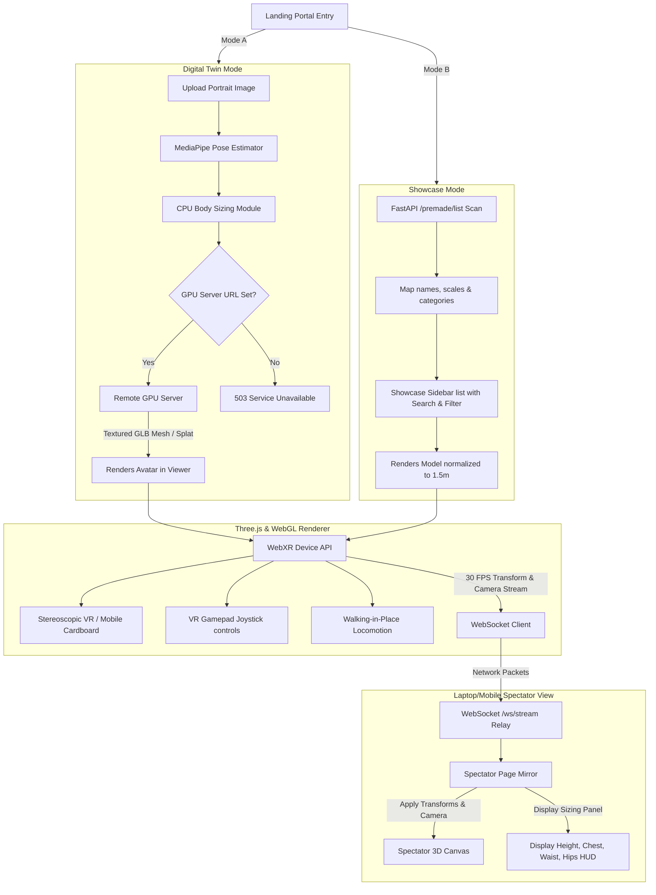
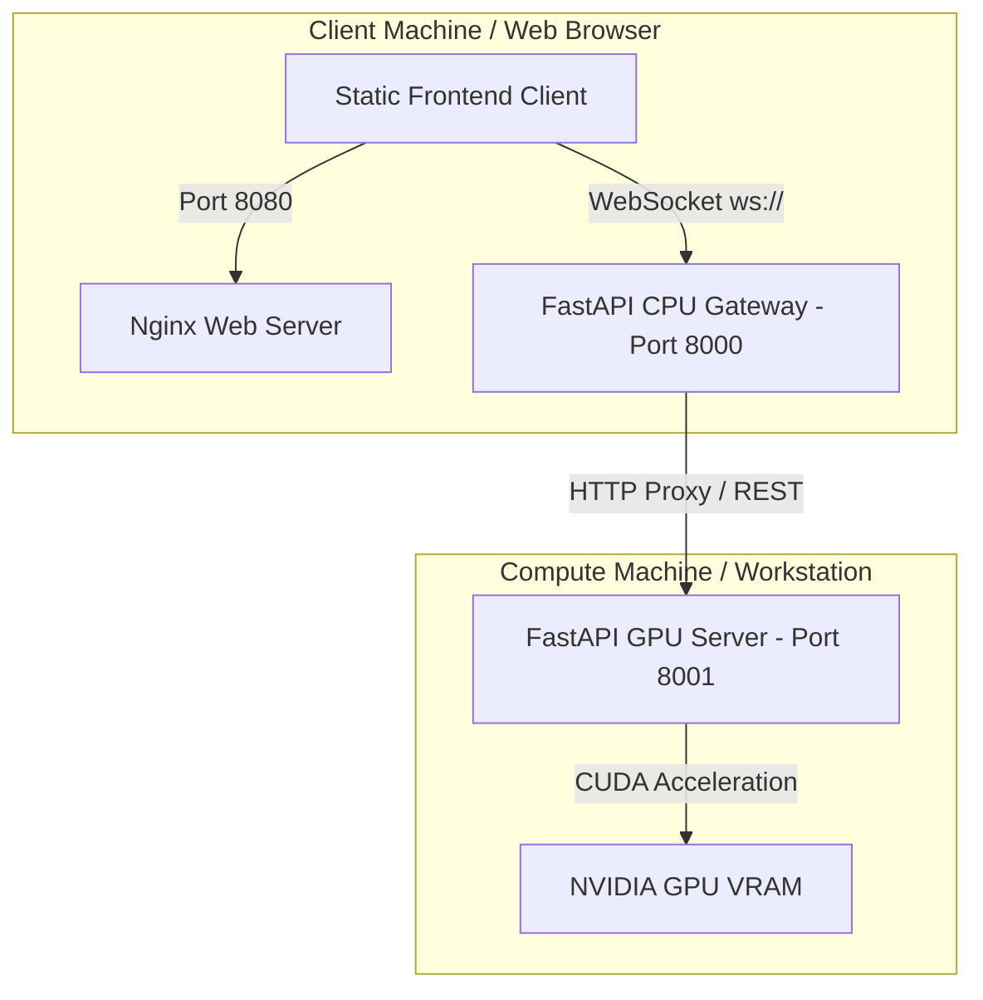
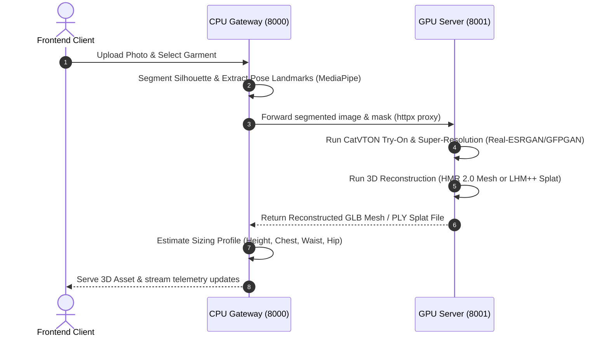

# VR Try-On Studio & Immersive WebXR Avatar Creator

[](https://www.python.org/)
[](https://fastapi.tiangolo.com/)
[](https://threejs.org/)
[](https://www.docker.com/)
[](https://developer.nvidia.com/cuda-toolkit)
[](https://dvc.org/)

An immersive, hardware-accelerated WebXR virtual dressing room and digital twin application. The project is split into a lightweight **CPU API Gateway (Backend)**, a responsive **Static Client (Frontend)**, and a high-performance **GPU Inference Server** supporting virtual try-on (CatVTON), AI Super-Resolution (Real-ESRGAN/GFPGAN), and 3D avatar reconstruction (4D-Humans SMPL meshes & LHM++ Gaussian Splats).

Throughout development, we evaluated and benchmarked several state-of-the-art reconstruction and try-on models (including Trellis 2.0, Hunyuan3D, Pixal3D, InstantMesh, and Meshy AI) to design a dual-mode virtual showroom optimized for mobile WebXR viewports and real-time spectator mirroring.

---

## 1. Project Overview & Core Features

The primary objective of this project is to address the high rate of product returns in fashion e-commerce by providing shoppers with a personalized 3D digital twin and quantitative body measurements directly in their browser.

### Key Capabilities:
* **2D Virtual Try-On:** Wraps and transfers garment images onto shopper portraits using the **CatVTON** model, upscaled and enhanced via **Real-ESRGAN** and **GFPGAN**.
* **Dual-Engine 3D Reconstruction:**
  * **Option A (Polygonal Mesh):** Generates rigged 3D human models using **4D-Humans (HMR 2.0)**, regressed to the parametric **SMPL model** template.
  * **Option B (Point Cloud):** Produces detailed 3D human splats using the **LHM++** transformer architecture.
* **Quantitative Body Sizing:** Computes shopper measurements (height, chest, waist, and hip circumference) using **MediaPipe** pose landmarks and mesh vertex distances.
* **Immersive WebXR Viewport:** Renders the 3D digital twin inside a Three.js WebGL scene, supporting desktop orbit controls, stereoscopic VR (Google Cardboard/Quest), Bluetooth gamepad navigation, and accelerometer-based **Walking-in-Place (WIP)** locomotion.
* **WebSocket Spectator Mirroring:** Broadcasts camera coordinates and avatar transforms from the primary VR headset to a remote spectator screen in real-time, allowing mirroring and qualitative styling consulting.

---

## 2. Technology Stack Mapping

The platform is designed around a decoupled, microservices-oriented architecture:

| System Layer | Component / Tech | Version / Library | Architectural Role |
| :--- | :--- | :--- | :--- |
| **Frontend** | Three.js | r128 | WebGL rendering engine for 3D meshes & point clouds |
| | WebXR Device API | Browser Native | Accesses mobile accelerometer/gyroscope sensors & VR |
| | HTML5 / Vanilla CSS | — | Cyberpunk theme UI, viewport overlays, and mobile HUDs |
| | WebSocket Client | Browser Native | Telemetry transmission for spectator mirroring |
| **CPU Gateway** | Python | 3.10 | Backend runtime language |
| | FastAPI | 0.139.0 | REST endpoints & WebSocket state connection manager |
| | MediaPipe | 0.10.8 | CPU-bound pose landmarks detection & sizing calculations |
| | OpenCV | 4.8.1 | Image processing and silhouette mask generation |
| **GPU Inference** | PyTorch | 2.1.0 + CUDA | Deep learning framework runtime |
| | FastAPI | 0.139.0 | GPU endpoint management & VRAM unloading triggers |
| | CatVTON | Zheng-Chong | Inpainting diffusion-based virtual try-on model |
| | 4D-Humans | HMR 2.0 (SMPL) | Monocular 3D human mesh recovery model |
| | LHM++ | Damo-XR-Lab | 3D human point-cloud reconstruction transformer |
| | Real-ESRGAN | 0.3.0 | AI image upscaling and super-resolution |
| | GFPGAN | 1.3.8 | Generative facial prior network for face restoration |
| **DevOps & Data** | Docker | Enabled | Standardized containerization for services |
| | Docker Compose | 3.8 | Multi-container orchestration (web, backend, GPU) |
| | DVC | 3.38.1 | Data Version Control for 3D assets & datasets |
| | Ngrok | — | Secure tunnel ingress for remote GPU instances |

---

## 3. System Architecture & Flows

### A. Dual-Mode Operations Flow
This diagram details the flow of user operations between the Digital Twin Creator and the Showcase Catalog:



### B. Network Topology & Port Mapping
This diagram outlines the port configurations and network routing between the frontend client, the CPU gateway host, and the GPU compute server:



### C. Try-On & 3D Reconstruction Pipeline
This diagram traces the sequence of operations from the initial image upload to the final 3D asset rendering:



---

## 4. Directory Layout & Module Maps

The codebase is organized into a modular, container-ready microservices layout:

```bash
VRBased_Clothing_TryOns/
│
├── frontend/                     # Client Web Application
│   ├── Dockerfile                # Nginx docker image configuration
│   ├── index.html                # Main Portal Entry and Importmaps
│   ├── spectator.html            # Desktop Spectator single-view layout
│   ├── styles.css                # Cyberpunk styling overlays and responsive HUDs
│   ├── viewer.js                 # App Entry Point & Animation loop
│   ├── spectator.js              # Spectator controller and render loop
│   ├── ws-client.js              # WebSocket client interface (bracket IPv6 patched)
│   ├── scene-setup.js            # Three.js setups (lights, cameras, renderer)
│   ├── xr-manager.js             # WebXR session triggers and resets
│   ├── ui-handlers.js            # Mode selectors, uploads & search filter
│   ├── model-loader.js           # GLTF/GLB alignment and surface calibration
│   ├── gamepad.js                # VR bluetooth joystick polling
│   ├── wip-locomotion.js         # Accelerometer-based stepping locomotion
│   └── data/                     # Client local assets
│       ├── assets/               # Standard UI placeholders, logos & icons
│       └── demo/                 # sample_mesh.ksplat (Three.js viewer splash mesh)
│
├── Backend/                      # Python FastAPI server (CPU Host / API Gateway)
│   ├── Dockerfile                # CPU-optimized Python docker configuration
│   ├── main.py                   # FastAPI initialization, WebSocket relay & scavenger
│   ├── dataset_preprocessing.py  # Offline clothes extractor for dataset compilation
│   ├── requirements.txt          # Lightweight CPU-only Python requirements
│   ├── api/routes/
│   │   ├── catalog.py            # Serves processed clothing items lists
│   │   ├── mesh.py               # Re-routes 3D twin / try-on requests to GPU Server
│   │   └── photo.py              # Handles image validation & landmark extraction
│   ├── core/
│   │   ├── config.py             # Loads environment variables from .env
│   │   └── database.py           # In-memory mock database for active user profiles
│   └── services/
│       ├── pose_service.py       # Extracts MediaPipe landmarks
│       └── segmentation_service.py # Generates silhouette masks (CPU optimized)
│
├── gpu-server/                   # Remote GPU Inference Server
│   ├── Dockerfile                # NVIDIA CUDA PyTorch compiler docker configuration
│   ├── main.py                   # GPU Server FastAPI (expose /reconstruct-4d & /tryon)
│   ├── catvton_service.py        # CatVTON Diffusion model execution
│   ├── upscaler_service.py       # Real-ESRGAN and GFPGAN AI Super-Resolution
│   ├── hmr2_service.py           # 4D-Humans 3D avatar mesh builder
│   ├── lhmpp_service.py          # LHM++ 3D model processing executor
│   ├── requirements.txt          # Heavy CUDA/Deep-Learning Python requirements
│   └── setup_models.py           # Hugging Face & ModelScope weights pre-downloader
│
├── data/                         # Data assets (Excluded from Git / Tracked via DVC)
│   ├── dataset_myntra/           # Raw Myntra source images (DVC Tracked)
│   ├── dataset_processed/        # Preprocessed transparent clothing & catalog.json (User Generated)
│   ├── premade/                  # Showcase 3D model meshes (DVC Tracked)
│   └── meshes/                   # Runtime user-generated 3D twin models
│
├── setup_project.py              # Automated virtualenv setup script
├── run_colab_gpu.ipynb           # Google Colab / Kaggle remote GPU tunnel notebook
├── docker-compose.yml            # Multi-container orchestration (web, backend, GPU)
└── .gitignore                    # Global gitignore excluding weights, caches & venvs
```

---

## 5. Pre-Trained Weights & Model Cache Setup

The 3D mesh reconstruction module (4D-Humans) requires neutral body template weights (SMPL model) which cannot be distributed directly in the repository due to licensing restrictions. These weights must be manually downloaded and placed in the system's cache folder before running the GPU server.

### Step-by-Step SMPL Weights Setup:
1. **Register an Account**: Go to the MPI SMPLify website (https://smplify.is.tue.mpg.de/) and create a free account.
2. **Download the Package**: Once logged in, go to the Downloads page and download the package titled "SMPL for Python" (version 1.0.0).
3. **Extract and Rename**: Extract the downloaded zip file. Navigate inside it to find the file `basicModel_neutral_lbs_10_207_0_v1.0.0.pkl`. Rename this file to `SMPL_NEUTRAL.pkl` (all uppercase).
4. **Place in Cache Folder**: Create the directory structure on the machine running the GPU server (or your local computer if running locally) and place the renamed file inside:
   * **Linux / Google Colab**: Copy the file to `~/.cache/4DHumans/data/smpl/SMPL_NEUTRAL.pkl` (create the directory if it does not exist: `mkdir -p ~/.cache/4DHumans/data/smpl`)
   * **Windows**: Copy the file to `C:\Users\<Your_Windows_Username>\.cache\4DHumans\data\smpl\SMPL_NEUTRAL.pkl`
5. **Other AI Weights**: All other model weights (such as CatVTON try-on models, ViTDet object detectors, Real-ESRGAN upscalers, and GFPGAN face restorers) are public. They will automatically download from Hugging Face on the first run of the server, or they can be pre-cached by running the automated downloader script.

### Storage Space Estimation:
- **CPU Host (Backend + Frontend)**: ~2.5 GB total
  - Python Virtual Environment: ~1.5 GB
  - Datasets & Showcase Assets: ~1.0 GB
- **GPU Host (GPU Server + AI Weights)**: ~22.0 GB - 25.0 GB total
  - GPU Virtual Environment (PyTorch, Detectron2, etc.): ~5.0 GB
  - Stable Diffusion Inpainting & CatVTON weights: ~8.0 GB
  - LHM++ prior files & LHMPP-700M model: ~4.1 GB
  - 4D-Humans (HMR2) & Detectron2 weights: ~2.1 GB
  - Real-ESRGAN, GFPGAN, SMPL templates, and Job outputs: ~1.0 GB

---

## 6. Dataset Management & Preprocessing

The raw datasets are tracked using DVC (Data Version Control) to keep the Git repository lightweight.

### A. Download Datasets (via DVC)
The DVC remote storage repository configuration is pre-configured inside `.dvc/config`. Users do not need to manually configure credentials to pull files. To pull the datasets directly to the workspace, run:
```powershell
dvc pull
```
*(This downloads data/dataset_myntra and data/premade instantly to the local workspace.)*

### B. Generate Processed Clothes Catalog
data/dataset_processed/ is not checked in to Git. To generate the cropped, transparent clothing items and build the catalog.json database, run the preprocessing script inside the Backend folder:
* **On Windows**:
  ```powershell
  cd Backend
  .venv\Scripts\activate
  python dataset_preprocessing.py
  ```
* **On Linux/macOS**:
  ```bash
  cd Backend
  source .venv/bin/activate
  python dataset_preprocessing.py
  ```
*(This parses all images, runs SegFormer/CPU-thresholding to isolate the clothes, and compiles the database at data/dataset_processed/catalog.json.)*

---

## 7. Repository Dependencies Setup (CatVTON & LHM++)

The GPU server relies on external modules from CatVTON (Virtual Try-on) and LHM++ (Large Human Model). These repositories must be cloned into the shared models directory in the project root:

```bash
# Navigate to the project root and create the models directory
mkdir models
cd models

# Clone CatVTON
git clone https://github.com/Zheng-Chong/CatVTON.git

# Clone LHM++
git clone https://github.com/Damo-XR-Lab/LHM-plusplus.git
```
*Alternatively, if these repositories are already cloned elsewhere on the compute machine, define the environment variables CATVTON_ROOT and LHM_ROOT pointing to their absolute directory locations.*

---

## 8. Setup Options & Step-by-Step Setup Guides

Users can configure and deploy the system via three primary routes depending on their hardware availability.

---

### Route 1: Single-Machine Setup (All services running on one system with an NVIDIA GPU)

This route runs the Frontend, CPU Backend gateway, and GPU Compute Server on the same local GPU-enabled PC.

#### Option A: Running natively via Python Virtual Environments
1. **Prepare SMPL Templates:** Ensure the MPI neutral body file basicModel_neutral_lbs_10_207_0_v1.0.0.pkl is saved as SMPL_NEUTRAL.pkl in the user's home folder under ~/.cache/4DHumans/data/smpl/ (see Section 5).
2. **Install Environments & Dependencies:** Run the master setup script from the project root:
   ```powershell
   python setup_project.py
   ```
   * Select "y" when prompted to configure the local GPU virtual environment.
   * Select the appropriate CUDA version corresponding to the system's GPU drivers (CUDA 11.8 or CUDA 12.1).
   * Select "y" when prompted to pre-download the model weights to cache them before runtime.
3. **Start the Frontend Web Server (Port 8080):**
   ```powershell
   python -m http.server 8080 --directory frontend
   ```
4. **Start the CPU Backend Gateway (Port 8000):**
   * **On Windows**:
     ```powershell
     cd Backend
     .venv\Scripts\activate
     uvicorn main:app --reload --host 0.0.0.0 --port 8000
     ```
   * **On Linux/macOS**:
     ```bash
     cd Backend
     source .venv/bin/activate
     uvicorn main:app --reload --host 0.0.0.0 --port 8000
     ```
5. **Start the GPU Compute Server (Port 8000 on GPU host, internally remapped):**
   * **On Windows**:
     ```powershell
     cd gpu-server
     .venv\Scripts\activate
     python main.py
     ```
   * **On Linux/macOS**:
     ```bash
     cd gpu-server
     source .venv/bin/activate
     python main.py
     ```
6. **Open and Use:**
   * Open http://localhost:8080 in a web browser.
   * Navigate to settings and ensure the GPU Server URL matches http://localhost:8000 (or the local IP address).

#### Option B: Running via Docker Compose
1. **Verify Prerequisites:** Ensure Docker Desktop is running. 
   * *If running on Windows (Docker Desktop + WSL2 backend), WSL2 will automatically pass the local GPU VRAM to the container. Installing the NVIDIA Container Toolkit is not required.*
   * *If running on Linux, ensure the NVIDIA Container Toolkit is installed.*
2. **Build and Launch the Containers:** Run the following command from the project root:
   ```powershell
   docker-compose up --build -d
   ```
3. **Monitor the GPU Compute Logs:**
   ```powershell
   docker-compose logs -f gpu-compute
   ```
4. **Access the Application:**
   * Frontend: Accessible at http://localhost:8080
   * Gateway API docs: Accessible at http://localhost:8000/docs
   * *The containers handle routing automatically. The GPU service is exposed on host port 8001 and relayed inside the Docker network.*

---

### Route 2: Dual-Machine Setup (Laptop CPU Gateway + Separate GPU PC Compute Server)

This route is suitable for inspecting or testing the interface on a lightweight laptop (like a Macbook or thin notebook without an NVIDIA GPU) while offloading the heavy rendering and neural network execution to a separate GPU PC on the same local network (LAN).

#### Option A: Running natively via Python Virtual Environments
1. **On the Laptop (CPU Host):**
   * Run the master setup script:
     ```powershell
     python setup_project.py
     ```
     *(Select "N" when prompted to set up the GPU virtual environment, as the laptop won't run GPU tasks).*
   * Start the Frontend Web Server:
     ```powershell
     python -m http.server 8080 --directory frontend
     ```
   * Start the CPU Backend Gateway:
     * **On Windows**:
       ```powershell
       cd Backend
       .venv\Scripts\activate
       uvicorn main:app --reload --host 0.0.0.0 --port 8000
       ```
     * **On Linux/macOS**:
       ```bash
       cd Backend
       source .venv/bin/activate
       uvicorn main:app --reload --host 0.0.0.0 --port 8000
       ```
2. **On the GPU PC (Compute Server):**
   * Copy the gpu-server folder to the GPU PC.
   * Set up the GPU virtual environment using the setup script:
     ```powershell
     python setup_project.py
     ```
     *(Select "y" to install GPU virtualenv and pre-download the model weights via setup_models.py)*.
   * Start the GPU Server:
     * **On Windows**:
       ```powershell
       cd gpu-server
       .venv\Scripts\activate
       python main.py
       ```
     * **On Linux/macOS**:
       ```bash
       cd gpu-server
       source .venv/bin/activate
       python main.py
       ```
3. **Link them together:**
   * Find the local LAN IP address of the GPU PC (e.g., 192.168.1.50 on Windows by running ipconfig or on Linux/macOS via ifconfig).
   * On the laptop, open http://localhost:8080 in the browser.
   * Click the settings gear on the landing page and paste the GPU PC's IP and port into the GPU Server URL input:
     http://192.168.1.50:8000
   * Click Save Settings. The laptop will now forward all mesh generation, segmentation, and try-on requests to the GPU PC.

#### Option B: Running via Docker
1. **On the Laptop (Frontend & Backend):**
   * Open docker-compose.yml and comment out or remove the gpu-compute service declaration.
   * Run Docker Compose to build and start only the frontend and backend CPU containers:
     ```powershell
     docker-compose up --build -d
     ```
     *(This takes up only ~550 MB of space on the laptop).*
2. **On the GPU PC (Inference Server):**
   * Clone the codebase and navigate to the gpu-server folder.
   * Build only the GPU Docker image:
     ```bash
     docker build -t vr-gpu-server .
     ```
   * Launch the container with GPU access enabled and port 8000 exposed:
     ```powershell
     docker run -d --gpus all --name vr-gpu-server -p 8000:8000 --restart always vr-gpu-server
     ```
3. **Link them together:**
   * Open the frontend on the laptop (http://localhost:8080).
   * Click settings and enter the GPU PC's local network IP: http://<gpu-pc-ip>:8000

---

### Route 3: Hybrid Remote GPU Setup (Laptop Local + Cloud GPU via Google Colab / Kaggle)

This route is suitable when a local NVIDIA GPU is unavailable, allowing the heavy rendering models to run on cloud GPU servers (Google Colab or Kaggle).

1. **On the Laptop:**
   * Run the master setup script:
     ```powershell
     python setup_project.py
     ```
     *(Select "N" for local GPU setup).*
   * Start the Frontend Web Server:
     ```powershell
     python -m http.server 8080 --directory frontend
     ```
   * Start the CPU Backend Gateway:
     * **On Windows**:
       ```powershell
       cd Backend
       .venv\Scripts\activate
       uvicorn main:app --reload --host 0.0.0.0 --port 8000
       ```
     * **On Linux/macOS**:
       ```bash
       cd Backend
       source .venv/bin/activate
       uvicorn main:app --reload --host 0.0.0.0 --port 8000
       ```
2. **In the Cloud (Google Colab / Kaggle):**
   * Upload the [run_colab_gpu.ipynb](run_colab_gpu.ipynb) notebook to Google Colab.
   * Select a T4 GPU runtime (or any higher GPU) under Runtime > Change runtime type.
   * Paste the Ngrok Auth Token (get one for free at dashboard.ngrok.com) in Cell 2.
   * Run all cells. This will clone the repository, install CUDA PyTorch, compile packages, download weights, launch the GPU server, and establish a secure tunnel.
   * Copy the public URL generated by ngrok (e.g., https://xxxx.ngrok-free.app).
3. **Link them together:**
   * Open the web app on the laptop (http://localhost:8080).
   * Click the settings gear on the landing page, paste the ngrok URL into the GPU Server URL box, and click Save Settings.
   * All CatVTON try-ons and 4D-Humans reconstructions will now run in the Colab cloud and return results instantly to the laptop.

---

## 9. Credits & License

### Contributors
This project was developed during a summer internship at **BISAG-N** (Bhaskaracharya National Institute for Space Applications and Geo-informatics) by:
- **Anant Jain**
- **Karmveer Kumar**
- **Vishvendra**

### License
This project is licensed under the MIT License. See the [LICENSE](LICENSE) file for details.

---

## 10. Troubleshooting & Issue Tracking
If any issues, bugs, or runtime problems occur during setup or execution, users are encouraged to open an issue directly in the repository's issue tracker, or submit a Pull Request with bug fixes, enhancements, or documentation updates.
