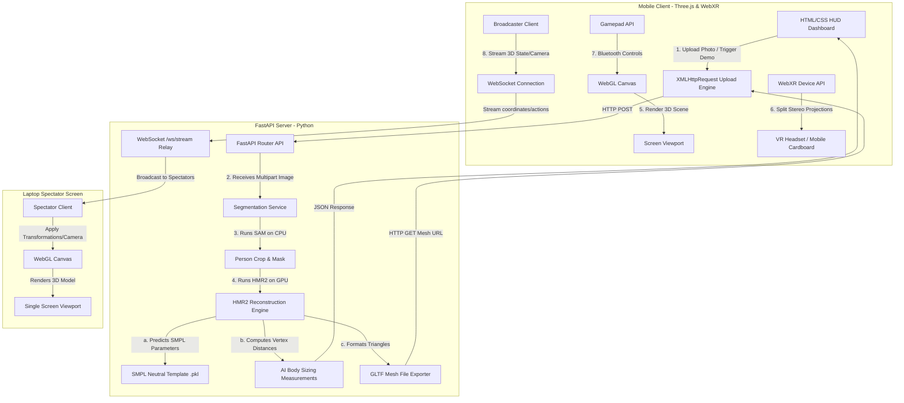

# Immersive 3D Digital Twin WebXR Viewer

An immersive, hardware-accelerated WebXR browser application integrated with a Python AI backend to reconstruct and inspect customized 3D human digital twins from single-view portrait images.

---

## 1. System Architecture & Workings



### Frontend Technology Stack (Three.js, WebGL & WebXR)
* **WebGL:** Communicates directly with the GPU using compiled shaders to draw human meshes consisting of thousands of triangles at high framerates.
* **Three.js:** Exposes clean object-oriented APIs to manage the scene graph, lighting nodes (Ambient fill, Hemisphere sky bounce, Directional key, and Neon spotlights), dynamic shadow maps, and material calibrations.
* **WebXR Device API:** Negotiates high-refresh-rate stereoscopic viewpoints, manages inter-pupillary distance (IPD) offsets inside VR headsets, and polls gamepad controller triggers.

### Backend Technology Stack (4D-Humans & SMPL)
* **Segmentation Service:** Uses **Detectron2** to locate the subject and **Segment Anything Model (SAM)** (run on CPU to optimize VRAM footprint) to extract a clean background mask.
* **Feature Extraction:** Feeds the cropped human bounding box through a **ViT-Det (Vision Transformer)** backbone to extract detailed pose and body shape representations.
* **SMPL Body Template:** Predicts 10 shape parameters ($\beta$ PCA coefficients) and 72 pose parameters ($\theta$ joint rotations), deforming the 6,890 template vertices of [basicModel_neutral_lbs_10_207_0_v1.0.0.pkl](file:///c:/Coding_files/Internship3rdYEAR/VR_development/internship_week3/Backend/data/basicModel_neutral_lbs_10_207_0_v1.0.0.pkl) to generate a customized mesh.
* **AI Sizing Calculations:** Computes Euclidean distances between specific indices of the deforming body vertices to estimate Height, Chest, Waist, and Hip circumferences in centimeters.

### WebSocket State Synchronization Relay
* **State Broadcasting:** Mobile client polls and streams model URLs, transformation changes, and camera coordinates at 30 FPS over WebSockets to a FastAPI relay endpoint.
* **Spectator Mirroring:** The spectator page receives the stream, normalizes mesh URLs to prevent CORS conflicts, and applies coordinates directly onto a flat-screen camera to sync the viewport.

---

## 2. Directory Layout & Module Maps

```bash
internship_week3/
│
├── frontend/                     # Client application (Static Web Server Root)
│   ├── data/demo/                # Offline fallback meshes
│   │   └── 9dc6216c..._mesh.gltf # Local mannequin fallback model
│   ├── index.html                # HTML DOM structure and Importmaps
│   ├── spectator.html            # Desktop Spectator single-view layout
│   ├── styles.css                # Cyberpunk overlays and mobile layouts
│   ├── viewer.js                 # App Entry Point & Animation loop
│   ├── spectator.js              # Spectator controller and render loop
│   ├── ws-client.js              # WebSocket client interface
│   ├── scene-setup.js            # Three.js core setups (lights, cameras, renderer)
│   ├── xr-manager.js             # WebXR session triggers and mobile resets
│   ├── ui-handlers.js            # Event listeners and XHR upload progress engine
│   ├── model-loader.js           # GLTF meshes alignment and surface calibration
│   └── gamepad.js                # VR bluetooth joystick polling
│
├── Backend/                      # Python FastAPI server
│   ├── api/routes/mesh.py        # Mesh POST generation route
│   ├── services/                 # AI reconstruction orchestrators
│   │   ├── segmentation_service.py # Runs SAM background isolation (CPU)
│   │   └── mesh_service.py       # Interacts with HMR2 and exports GLTF
│   ├── data/                     # Neutral SMPL template weights (.pkl)
│   ├── weights/                  # Pre-trained deep learning checkpoint weights
│   ├── main.py                   # FastAPI initialization
│   └── requirements.txt          # Python package dependency configurations
│
└── README.md                     # Project documentation
```

---

## 3. WebXR & VR Code Integration Locations
WebXR session setups are implemented inside [viewer.js](file:///c:/Coding_files/Internship3rdYEAR/VR_development/internship_week3/frontend/viewer.js) and [xr-manager.js](file:///c:/Coding_files/Internship3rdYEAR/VR_development/internship_week3/frontend/xr-manager.js):

* **WebGLRenderer WebXR Activation:** Enabled via `renderer.xr.enabled = true` inside `initScene()` in [scene-setup.js](file:///c:/Coding_files/Internship3rdYEAR/VR_development/internship_week3/frontend/scene-setup.js).
* **Hardware Support Checks:** Queries `navigator.xr.isSessionSupported('immersive-vr')` inside `setupWebXR()` in [xr-manager.js](file:///c:/Coding_files/Internship3rdYEAR/VR_development/internship_week3/frontend/xr-manager.js) to enable the VR button.
* **VR Presentation Session:** Calls `navigator.xr.requestSession('immersive-vr')` and feeds it into the renderer via `renderer.xr.setSession(session)`.
* **Animation Loop Compatibility:** Handled using `renderer.setAnimationLoop(renderLoop)` in [viewer.js](file:///c:/Coding_files/Internship3rdYEAR/VR_development/internship_week3/frontend/viewer.js) as standard `requestAnimationFrame` is blocked under immersive WebXR.

---

## 4. Local Setup & Installation

### A. Start the Python Backend (Port 8000)
1. Navigate into the `Backend` directory:
   ```cmd
   cd Backend
   ```
2. Activate your virtual environment:
   * **PowerShell:** `.venv/Scripts/Activate.ps1`
   * **Command Prompt (cmd):** `.venv\Scripts\activate.bat`
3. Run the FastAPI development server bound to all local interfaces:
   ```cmd
   .venv\Scripts\python -m uvicorn main:app --host 0.0.0.0 --port 8000
   ```

### B. Start the Frontend Web Server (Port 8080)
1. Open a separate terminal and navigate into the `frontend` folder:
   ```cmd
   cd frontend
   ```
2. Relaunch the static file server:
   ```cmd
   npx serve -l 8080
   ```

### C. Google Colab 3D Generation Setup (Optional - for high-fidelity meshes)
1. Open [colab_runner.ipynb](file:///c:/Coding_files/Internship3rdYEAR/VR_development/internship_week3/colab_runner.ipynb) in Google Colab.
2. Retrieve your **Ngrok Authtoken** from the [Ngrok Dashboard](https://dashboard.ngrok.com/).
3. Paste the authtoken into the second code cell of the notebook.
4. Run all cells in Colab. Once the server starts and the tunnel is online, copy the generated HTTPS ngrok URL (e.g. `https://xxxx.ngrok-free.app`).
5. Open the web interface at `http://localhost:8080` (or `http://localhost:8080` via Chrome Port Forwarding on mobile).
6. Click the **Settings Cog (⚙️)** in the top header and paste the ngrok URL.
7. Any subsequent image uploads will now route the visual 3D generation to the high-performance TRELLIS model in Colab, while the body sizing is executed locally on the backend. If the tunnel goes offline, the system automatically falls back to local procedural mannequin generation.

---

## 5. Mobile & Headset Connectivity Configurations

Because WebXR sensors require a **Secure Context**, browsers block VR/AR components over raw HTTP unless accessed via `localhost` or configured specifically.

### Method 1: Google Chrome Flags Bypass (Wireless)
1. Connect both your phone and laptop to the **same local Wi-Fi network**.
2. Note your laptop's local IP address (e.g. `192.168.1.15`).
3. On your mobile phone, open Chrome and navigate to: **`chrome://flags`**
4. Search for: **"Insecure origins treated as secure"**.
5. Enable the flag and input your laptop's address:
   `http://192.168.1.15:8080`
6. Relaunch Chrome. Open the page `http://192.168.1.15:8080` to interact.

### Method 2: USB Port Forwarding (Recommended - Network Independent)
1. Connect your mobile device to your laptop with a USB cable (with **USB Debugging** enabled in developer options).
2. Open Chrome on your laptop and go to: **`chrome://inspect`**
3. Click **Port forwarding...** and add two configurations:
   * Port `8080` $\rightarrow$ `localhost:8080`
   * Port `8000` $\rightarrow$ `localhost:8000`
4. Now, open **`http://localhost:8080`** directly on your phone. Chrome treats `localhost` as secure automatically, requiring no flags or IP updates if you change networks.

---

## 6. WebXR VR Gamepad Controller Mapping

When wearing a VR headset, you can control the digital twin using your controller thumbsticks:

* **Left Stick X-Axis (Horizontal):** Rotates the human twin on the Y-axis.
* **Left Stick Y-Axis (Vertical):** Scales the human twin size (range restricted from `0.3x` to `3.0x` for physics accuracy).
* **Button A (Index 0):** Resets the twin's rotation and scale back to baseline.
* **Button B (Index 1):** Terminates the immersive session programmatically to return to flat mode.
* **Button X (Index 2):** Toggles the visibility of the on-screen controls panel.

---

## 7. Real-Time Spectator Mirroring Console

To show a live feed of your VR/flat session on your laptop:

1. Open **`http://localhost:8080/spectator.html`** in your laptop's web browser.
2. Open **`http://<laptop_ip>:8080`** (or `http://localhost:8080` via USB) on your mobile device.
3. Once the mobile viewer loads/unloads models, rotates the mannequin, or moves the camera in immersive VR mode, the spectator console mirrors the exact viewpoint, scale, rotation, and AI measurements in real-time.
4. **Orbit Control Override:** The spectator page turns off manual camera orbit controls while active VR/phone camera stream coordinates are being synced. Manual camera controls on the spectator page automatically re-enable if streaming packets stop for more than 3 seconds.
